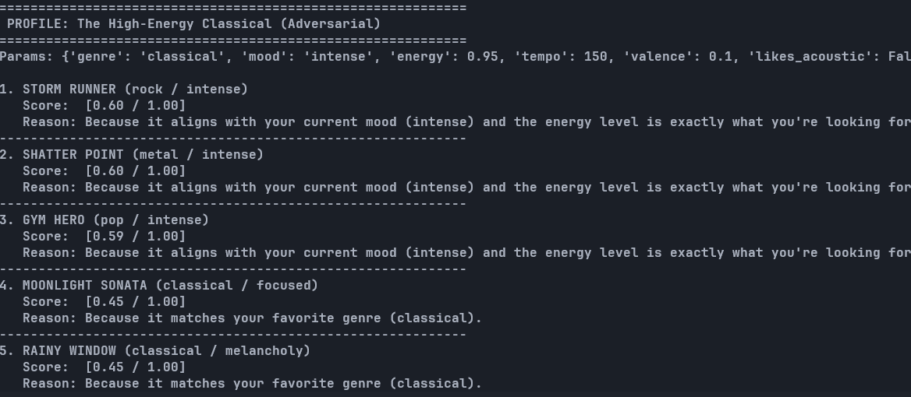
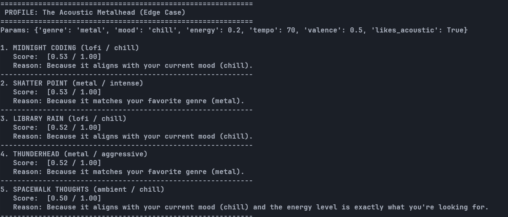
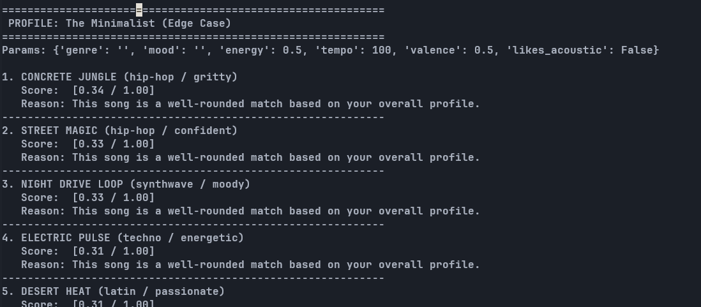
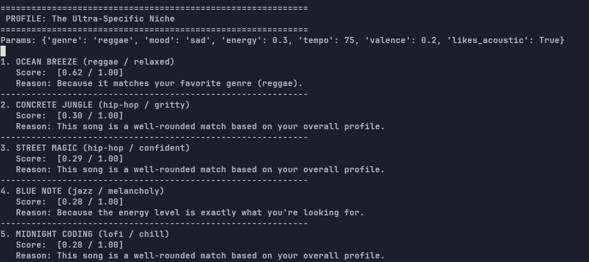

# 🎵 Music Recommender Simulation

## Project Summary

This project implements a modular, weighted music recommendation engine that transforms song metadata and user taste profiles into personalized suggestions. Our system uses a **Content-Based Filtering** approach, scoring songs based on their intrinsic attributes (genre, mood, energy, tempo, and valence) relative to a user's explicit preferences. The architecture is designed for scalability, featuring a clear separation between individual song scoring (Pointwise Evaluation) and global recommendation ranking (Listwise Evaluation).

---

## How The System Works

Our recommender operates through a multi-stage pipeline designed for transparency and precision.

### 1. Data Representation
- **Song Features**: Each song is represented by categorical tags and numerical features such as (`energy`, `tempo_bpm`, `valence`, `danceability`, `acousticness`).
- **UserProfile**: Stores the user's ideal targets for each feature that determines which attributes are most important for that specific user.

### 2. Scoring Logic (Pointwise Evaluation)
The `Recommender` computes a raw compatibility score (0.0 to 1.0) for every song using a weighted linear combination:
- **Categorical feature**: Exact matches on `genre` or `mood`.
- **Numerical features**: Distance-based calculation `weight * (1.0 - abs(song_value - user_target))` for features like Energy, Tempo, and Acousticness.

### 3. Ranking & Selection (Listwise Evaluation)
Once all songs are scored, the system sorts the library in descending order and selects the top `k` results. It then generates explanations highlighting why a song was chosen.

---

## Potential Biases and Faults

Because the system relies on a weighted linear combination, incorrect weighting can lead to several algorithmic biases:

### 1. The "Genre Bubble" (Over-weighting Categorical Features)
If the `genre` weight is too high (e.g., > 0.8), the system becomes a simple search engine rather than a recommender. It will ignore "perfect vibe" matches from other genres, even if their energy and mood are exactly what the user wants.

### 2. The "Averaging Effect" (Under-weighting Specificity)
If weights are spread too thinly across all features, no single attribute can "veto" a bad match. A song might rank highly just by being "okay" at everything, rather than being "great" at the one thing the user actually cares about (like high tempo for a workout).

### 3. Popularity/Energy Bias
If features like `energy` are heavily weighted, the system may naturally favor high-tempo genres like Pop and Metal over Ambient or Classical, simply because the numerical density of high-energy tracks in the catalog is higher.

### 4. Cold-Start Sensitivity
If the weights are improperly tuned for a new user, the first five recommendations might be inaccurate, leading to immediate user churn. A robust system needs "default" weights that prioritize safe attributes (like Mood) over risky ones (like specific BPM targets).


---

## Getting Started

### Setup

1. Create a virtual environment (optional but recommended):

   ```bash
   python -m venv .venv
   source .venv/bin/activate      # Mac or Linux
   .venv\Scripts\activate         # Windows

2. Install dependencies

```bash
pip install -r requirements.txt
```

3. Run the app:

```bash
python -m src.main
```

### Running Tests

Run the starter tests with:

```bash
pytest
```

### Sample Output

The following terminal output demonstrates the recommendations for a "Pop / Happy" user profile:

```text
==================================================
 🎵  YOUR PERSONALIZED MUSIC RECOMMENDATIONS  🎵 
==================================================
Target Vibe: Pop / Happy

1. SUNRISE CITY
   Artist: Neon Echo
   Score:  [0.97 / 1.00]
   Reason: Because it matches your favorite genre (pop) and it aligns with your current mood (happy) and the energy level is exactly what you're looking for.
--------------------------------------------------
2. SUMMER GROOVE
   Artist: Pop Star
   Score:  [0.96 / 1.00]
   Reason: Because it matches your favorite genre (pop) and it aligns with your current mood (happy) and the energy level is exactly what you're looking for.
--------------------------------------------------
3. GYM HERO
   Artist: Max Pulse
   Score:  [0.71 / 1.00]
   Reason: Because it matches your favorite genre (pop).
--------------------------------------------------
4. ROOFTOP LIGHTS
   Artist: Indigo Parade
   Score:  [0.60 / 1.00]
   Reason: Because it aligns with your current mood (happy) and the energy level is exactly what you're looking for.
--------------------------------------------------
5. CLOUD NINE
   Artist: LoRoom
   Score:  [0.48 / 1.00]
   Reason: Because it aligns with your current mood (happy).
--------------------------------------------------
```

You can add more tests in `tests/test_recommender.py`.

---

## Experiments You Tried

- **Weighting Shift (Energy vs. Genre)**: Doubled Energy weight (0.2) and halved Genre weight (0.175).
  - **Result**: The system became much more responsive to the "vibe" of the song. In the "Acoustic Metalhead" test, low-energy Lofi tracks successfully outranked high-energy Metal tracks.
  - **Conclusion**: This is "more accurate" for mood-based discovery but can lead to "genre-blindness" where the system ignores a user's explicit categorical preference.

#### Stress Test Visual Results:

| Adversarial (High-Energy Classical) | Edge Case (Acoustic Metalhead) |
| :---: | :---: |
|  |  |

| Edge Case (Minimalist) | The Ultra-Specific Niche |
| :---: | :---: |
|  |  |

- **Numerical Sensitivity**: Added `acousticness` and `danceability` to the scoring logic.

---

## Limitations and Risks

### 1. The Preference Trade-off (Categorical vs. Numerical)
Our experiments revealed a fundamental limitation in linear weighting: **intent collision**. By increasing the weight of numerical "vibe" features (like energy), the system naturally becomes "genre-blind." This creates a risk where a user who explicitly asks for "Classical" music might be recommended "Ambient" or "Lofi" simply because the numerical attributes match, potentially leading to user frustration.

### 2. Algorithmic Bias toward "High-Energy" Genres
Because the catalog has a higher density of high-energy tracks in certain genres (Pop, Metal, Rock), weighting `energy` heavily can create a systemic bias. The recommender may struggle to find "quiet" moments in a user's profile if the numerical differences in low-energy genres are too subtle to overcome the categorical weights of more dominant genres.

### 3. Catalog Limitations
- The system currently only works on a tiny, static catalog (30 songs).
- It does not understand lyrical content, cultural context, or artist reputation.
- It treats all numerical features as equally important unless manually tuned by the developer, which may not reflect how humans actually perceive music (e.g., a 10 BPM difference is more noticeable at 60 BPM than at 160 BPM).

You will go deeper on this in your model card.

---

## Reflection

Read and complete the Model Card for a full technical and ethical breakdown of this system:

[**🎧 View Model Card (model_card.md)**](model_card.md)

### What was learned
Through this project, I discovered that recommendation is a delicate balancing act...


---
