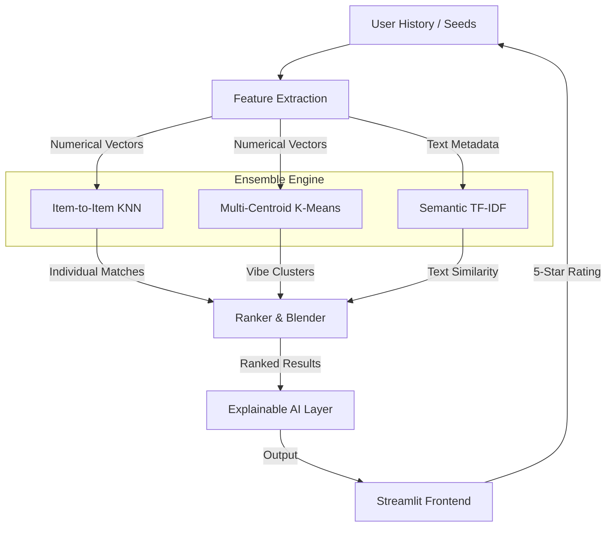
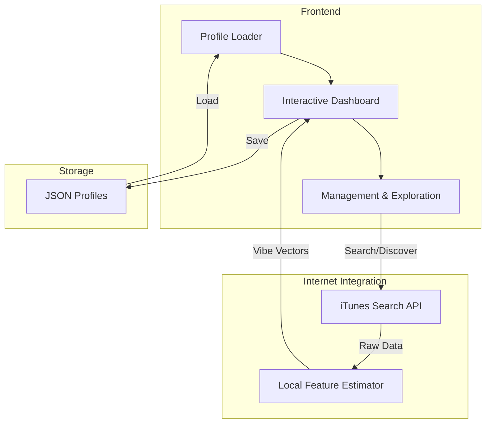

# System Architecture & Data Flow

## Ensemble Recommendation Architecture

The core of the system is a three-pillar ensemble model that ensures accurate and diverse suggestions.

## High-Level System Flow

## Strategy Details

### 1. Item-to-Item Similarity
- Each seed song acts as an individual query.
- Bypasses averaging to preserve polar-opposite tastes (e.g., Chill vs. Metal).

### 2. Multi-Centroid (K-Means)
- Groups user history into $K$ distinct taste clusters.
- Finds candidates that match the center of these specific "listening moods."

### 3. TF-IDF Semantic Matching
- Analyzes text metadata (Title, Artist, Genre).
- Captures nuances like "Remix," "Live," or specific artist names that numerical features might overlook.

### 4. Dynamic Weighting
- **Numerical Score**: 70% of total ranking weight.
- **Semantic Score**: 30% of total ranking weight.
- High-star feedback triggers a real-time shift in the session's active seeds.
