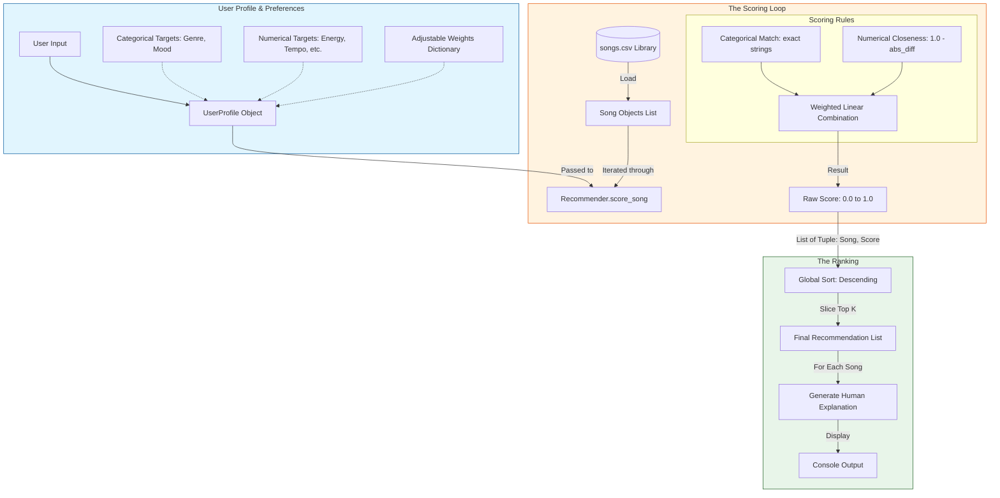

# System Data Flow & Architecture

The following Mermaid diagram outlines how data moves through the Music Recommender Simulation, from initial user input to the final generated recommendations.

## Data Flow Summary

1.  **Input**: The system captures a `UserProfile` containing both categorical preferences and numerical targets, along with a set of `weights` that define the importance of each feature.
2.  **Process (Pointwise)**: The system loops through every `Song` in the catalog. For each song, it calculates a weighted compatibility score using the `score_song` logic.
3.  **Ranking (Listwise)**: Once all songs have individual scores, they are sorted globally. The system then selects the top `K` results and generates natural language explanations for the user.
