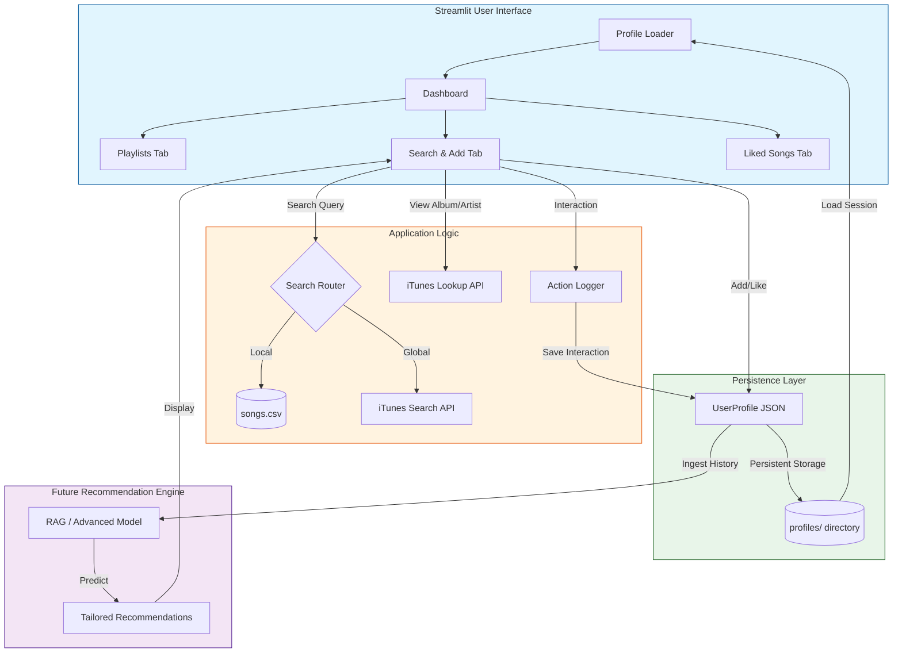

# System Architecture & Data Flow

The Music Recommender Extension has evolved into an interactive web application. The following diagrams outline the modern architecture and how user data flows through the system.

## High-Level Architecture

## Component Breakdown

### 1. Profile Persistence
- **State**: The `UserProfile` object is the single source of truth during a session.
- **Save**: Any change (creating a playlist, adding a song, liking a track) triggers an automatic `profile.save()` call, which serializes the state to `profiles/{name}.json`.
- **Load**: On startup, the UI lists all files in `profiles/`, allowing the user to resume their specific session.

### 2. Hybrid Search Engine
- **Local Branch**: Filters the internal `songs.csv` using pandas. This is fast and contains the specific audio features (energy, tempo) for the recommendation model.
- **Global Branch**: Queries the iTunes API in real-time. This provides access to millions of songs, album artwork, and audio previews.
- **Exploration**: Uses the iTunes `lookup` endpoint to drill down into specific album contents or artist discographies.

### 3. Interaction Logging
- Every user action is captured in the `user_metadata` field:
    - **Action**: "add_to_playlist", "like_song", "create_playlist".
    - **Context**: Timestamps, song metadata, and search source (Local vs. Global).
- This creates a rich behavioral dataset for future training of the advanced recommendation model.
